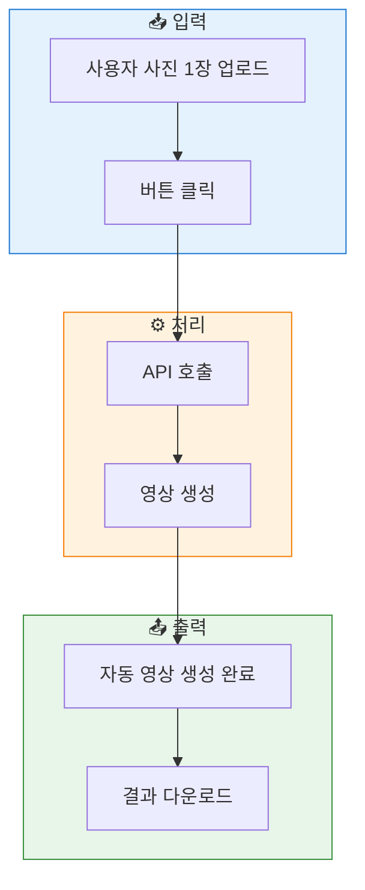
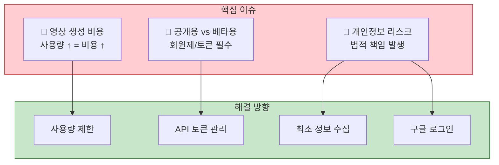
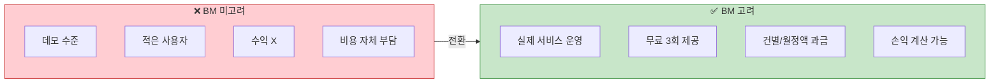
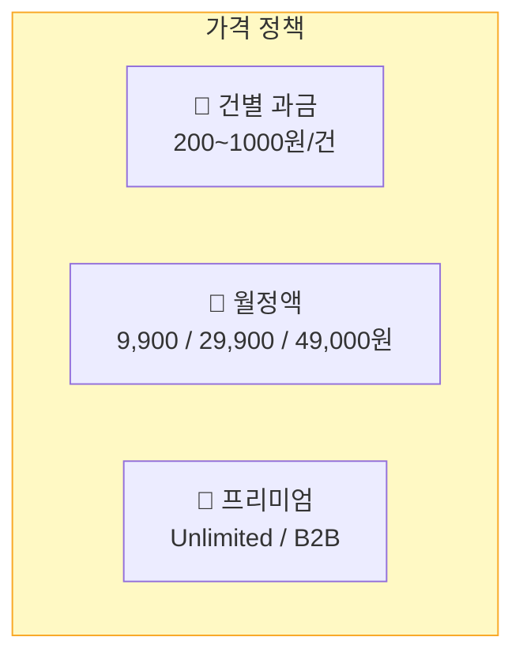
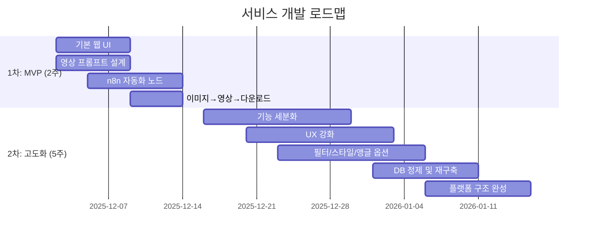
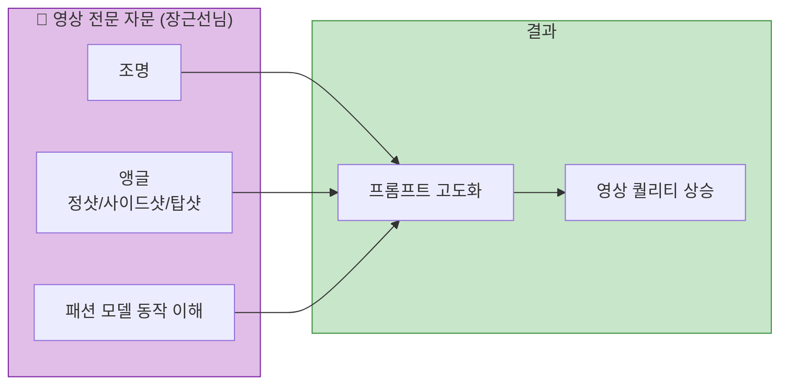
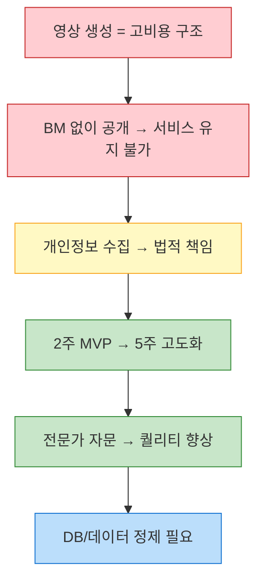

# 📌 DOTD_제3차_회의_기간별 업무 목표치 재설정_251128

---

## 1️⃣ 서비스 개요

- 사용자가 사진 1장 업로드 → 버튼 클릭 → 자동 영상 생성까지 되게 하는 AI 숏폼 자동화 서비스.
- 누구나 영상 생성 API를 호출할 수 있는 구조
- 서버 운영, API 비용, 트래픽 증가에 따른 비용 상승 문제 필수 고려
- 프로젝트 후 6개월 동안 외부 사용자도 고려해야 하므로 기술적/금전적 부담 발생

---

## 2️⃣ 핵심 이슈 요약

### 📌 ① 영상 생성 비용 구조
- "영상 생성" 자체가 고비용 → 사용량 증가 = 비용 증가
- 하루 1,000명은 가능해도, 10,000명 수준이면 손실 발생 가능
- 이미지→영상(아바타 만들기 등) 단계별 비용 다름
- DB 비용은 낮지만 영상 생성 코스트가 메인 부담

### 📌 ② 공개용 vs 베타용의 차이
- **내부 베타 테스트 프로그램** : 자유롭게 테스트 가능
- **외부 유저 공개 서비스** :
  → 무한히 돌리게 하면 망함
  → 회원제·API 토큰·사용량 제한 필수
  → 법적·운영상 이슈 발생(개인정보 수집·보관)

### 📌 ③ 개인정보 관련 법적/운영상 리스크
- 구글 로그인(소셜 로그인) 필요
- 개인정보를 수집·관리하면
  → 보안/법적 책임 발생
  → 약관, 개인정보처리방침 필요
- 가능하면 최소 정보만 받는 방향으로 설계 필요

---

## 3️⃣ BM(business model) 고려 여부에 따른 차이

### ✔ BM 고려 없음
- 데모 수준
- 적은 사용자 기반
- 수익 모델 X
- 영상 생성 비용을 수강생/운영진이 감수해야 함

### ✔ BM 고려 O
→ 실제 제품 서비스로 운영 가능
- 무료 횟수 제공 (예: 3회)
- 그 이후 결제 or 정액제 or 건별 과금
- unlimited 요금제 가능 (타 서비스 레이븐처럼)
- 예상 트래픽·사용자 수 기반 손익 계산 필수
- 배당 구조(협업 시)

---

## 4️⃣ 가격 정책 옵션

**건별 과금**
- 예: 1건 영상 생성 200~1000원
- 고해상도 또는 길이 늘어나면 추가 과금

**월정액**
- 예: 월 9,900원 / 월 29,900원 / 월 49,000원 등
- 생성 횟수 제한 or 제한 없음

**프리미엄 (unlimited plan)**
- 기업 제휴/대량 생성용 B2B 플랜

---

## 5️⃣ 서비스 개발 로드맵

### 🟩 1차 목표 (2주) — MVP 구축
- **핵심**: 영상을 스스로 생성하는가?
- 기본적인 웹 UI
- 영상 프롬프트 설계
- 영상 생성 자동화(n8n) 노드 구축
- 최소 기능: 이미지 업로드 → 영상 생성 → 결과 다운로드
- 출시 가능한 기본 틀 완성

### 🟦 2차 목표 (추가 5주) — 고도화 단계
- 1차 기반으로 기능 세분화
- 다양한 영상 아이디어 적용
- 사용자 경험(UX) 강화
- 필터, 스타일, 배경, 카메라 앵글 옵션 추가
- 검색 기능(패션 뉴스 등) 연동 가능성 검토
- DB 정제 및 재구축
- 가장 기본적인 '플랫폼 구조' 완성

---

## 6️⃣ 전문가 협업

### 🎥 영상 전문 자문 — 장근선님
- 조명
- 앵글 (정샷, 사이드샷, 탑샷, 래핑라이트 등)
- 패션 모델 동작 촬영 이해도
- → 이걸 기반으로 프롬프트 고도화 가능
- → "질 높은 영상 출력 가능성" 증가

---

## 7️⃣ 기술 한계 및 데이터 이슈

### ✔ 패션 뉴스/데이터 수집
- 구글 뉴스: 일부 외부접속(HTTP) 제한
- 외국 패션 사이트: 보안상 API 접근 어려움
- 네이버 검색: 정확도·구조화 데이터 수집 한계
- 현재 DB는 구조만 있고 필터링 및 정제 작업 필요

---

## 8️⃣ 정리된 결론

- 영상 생성 서비스는 비용이 크게 드는 구조
- BM(요금제·토큰·회원제) 없이 공개하면 서비스 유지 불가능
- 개인정보 수집 시 법적·운영상 책임 커짐
- 2주 MVP → 5주 고도화 전략이 현실적인 로드맵
- 전문가 자문으로 영상 퀄리티 상승 가능
- DB와 데이터 수집은 별도 정제가 필요

---
---

## 🔄 서비스 핵심 흐름도

---

## ⚠️ 핵심 이슈 구조

---

## 💰 BM 비교

---

## 💵 가격 정책 옵션

---

## 🗓️ 개발 로드맵

---

## 🎥 전문가 협업 구조

---

## 📊 정리된 결론

