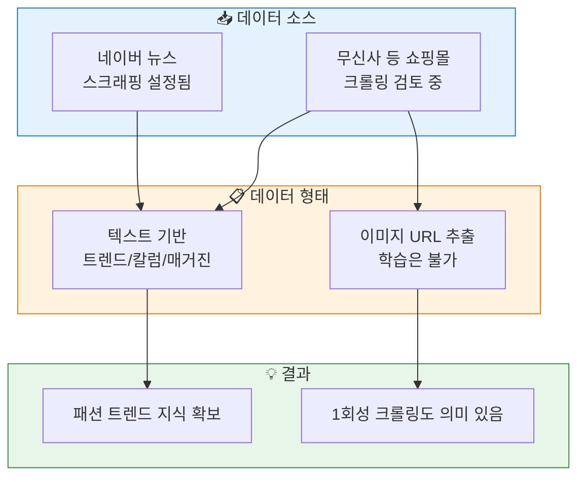
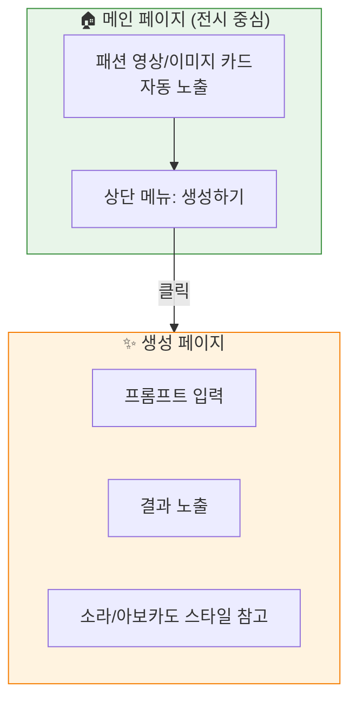
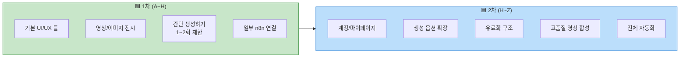
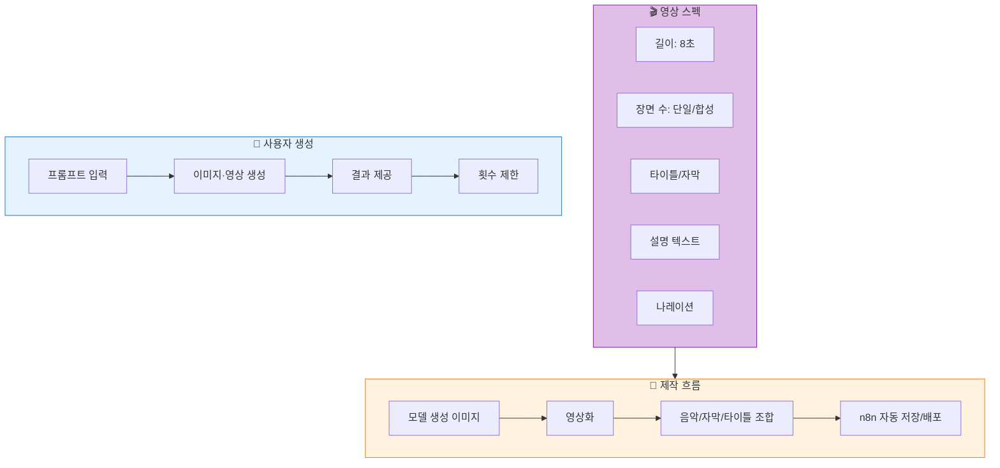
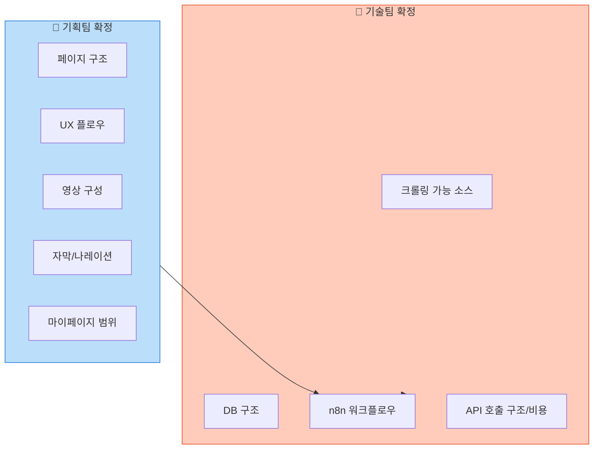
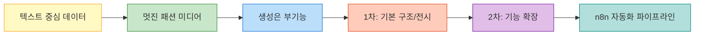

# 📌 DOTD_제4차_(파트장)회의_1차 기간 목표 샘플 재확인_251128

**참가자** : 김찬호 팀장, 오채언 부팀장, 정환석 기술파트장  
**회의 시간** : 10:35~11:20

---

## 1. 데이터·학습 관련 논의

### 1) 현재 구축 상황
- 기본 데이터 소스로 네이버 뉴스 스크래핑이 이미 설정됨.
- 최신 텍스트 기반 트렌드 확보에는 충분히 유용.

### 2) 추가하고 싶은 데이터 소스
- 무신사(MUSINSA) 같은 쇼핑몰 데이터를 넣어 최신 패션 트렌드 반영을 하고 싶음.
- 그러나 실제 크롤링 가능 여부는 HTML 구조·차단 정책 등에 따라 어려울 수 있음.

### 3) 이미지 학습 관련
- 이미지 자체를 모델이 학습시키는 것은 현재 구조로 불가능.
- HTML에서 이미지 URL까지는 추출 가능하지만
  → 이미지 파일 자체를 DB에 넣어 학습시키는 단계는 불가능.

### 4) 추천 데이터 형태
- 이미지보다 텍스트 기반 트렌드·칼럼·매거진 기사 데이터가 훨씬 효율적.
- 업데이트가 자주 안 돼도 무방 → 1회성 크롤링도 의미 있음.

### 5) 학습 효과
- 데이터 더 넣는다고 모델 품질이 정확히 얼마나 올라갈지는 알 수 없음.
  → 넣어보고 테스트해야 함.
- 중요한 건 텍스트 기반 '패션 트렌드 지식'을 확보하는 것 자체가 가치있음.

---

## 2. 사이트 구조·UX 방향성

### 1) 사이트가 해야 할 두 가지 역할
- 패션 미디어(자동 생성 영상·이미지 전시)
- 사용자가 직접 생성하는 기능(AI 생성하기)
- → 둘을 한 화면에 섞을지 / 페이지 분리할지 논의함.

### 2) 최종 방향성(현재 단계)
- 비주얼 중심 미디어 성격 우선
  → 멋진 패션 영상·이미지를 자동으로 보여주는 사이트
- 생성하기 기능은 "부 기능" 형태로 배치
- 유료화 등은 훨씬 후순위
  → 지금은 "멋지고 매력적인 사이트" 구현이 먼저

### 3) 페이지 구조 제안 (정리된 방향)

**A. 메인 페이지 (전시 중심)**
- 상단 메뉴에 "생성하기"
- 아래에는 자동 생성된 패션 영상/이미지 카드가 계속 노출

**B. 생성 페이지**
- 버튼 누르면 전환 (새 페이지)
- 프롬프트 입력 → 결과 노출
- → 소라 / 아보카도 스타일 참고 가능

---

## 3. 1차/2차 개발 범위

### 1차 목표 (A ~ H 정도)
- 기본적인 UI/UX 틀 완성
- 자동 생성된 영상/이미지 전시 기능 우선 구축
- 간단한 "생성하기" 기능 (1~2회 제한 등)
- 일부 자동화(n8n) 연결

### 2차 목표 (H ~ Z)
- 사용자 계정, 마이페이지
- 생성 옵션 확장
- 유료화 구조
- 고품질 영상 자동합성
- 전체 자동화 강화

---

## 4. n8n 관련 정리

### n8n에서 결정해야 할 요소

#### 1) 영상의 스펙
- 길이: (예: 8초)
- 장면 수: 단일 vs. 여러 장면 합성
- 타이틀/자막 여부
- 설명 텍스트 자동 생성 여부
- 나레이션(음성) 자동 삽입 여부

#### 2) 자동 영상 제작 흐름
- 모델 생성 이미지 → 영상화 → 음악/자막/타이틀 조합
- → n8n 워크플로우로 자동 저장/배포

#### 3) 사용자 생성 로직
- 프롬프트 입력
- → 이미지·영상 생성
- → 결과 제공
- → 생성 횟수 제한 가능

---

## 5. 다음 단계 (Action Items)

### 1) 기획팀과 다시 확정해야 할 것
- 페이지 구조 (1페이지 통합 vs. 분리)
- UX 플로우 (메인 → 생성 → 결과)
- 영상 구성(길이, 장면 수 등)
- 자막/나레이션 여부
- 마이페이지 구성 범위

### 2) 기술팀과 확정
- 크롤링 가능한 패션 소스
- DB 구조
- n8n 워크플로우 상세
- 영상 생성 API 호출 구조/비용

---

## ✔️ 최종 요약

- 데이터 추가할 때 텍스트 중심으로 구성하는 게 현실적
- 사이트는 "멋진 패션 영상 보여주는 미디어"가 우선
- 생성은 부 기능처럼 자연스럽게 제공
- 1차는 기본 구조/전시/간단 생성까지
- 2차부터 본격적인 기능 확장
- n8n(O) 자동화 기반으로 영상/이미지 생성 파이프라인 구축

---

---

## 🔄 데이터 수집 구조

---

## 🖥️ 사이트 구조

---

## 📊 1차/2차 개발 범위

---

## ⚙️ n8n 자동 영상 제작 흐름

---

## 📋 Action Items

---

## ✅ 최종 요약 흐름

