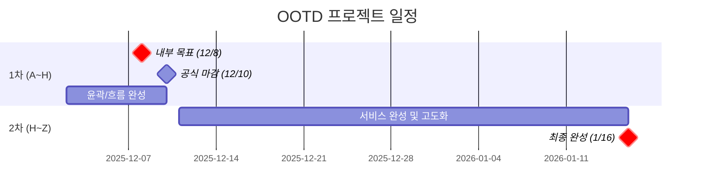
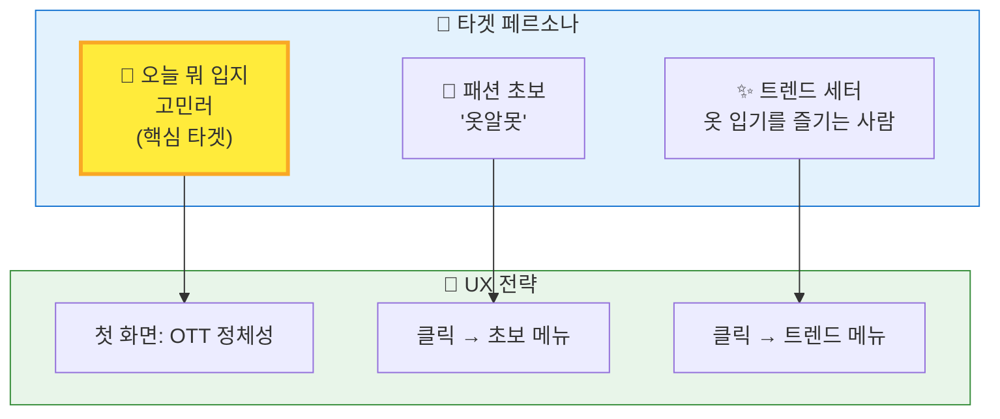
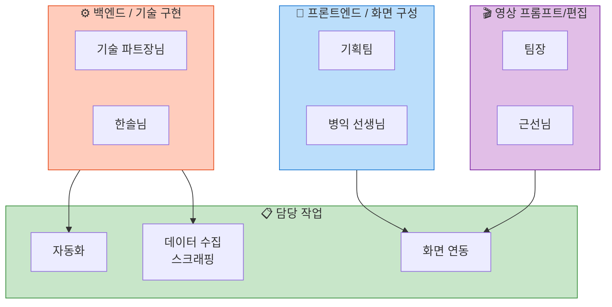
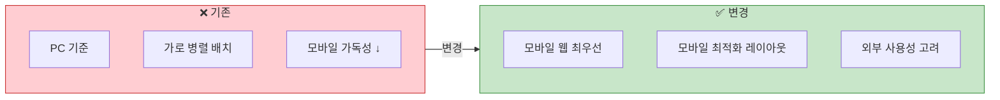
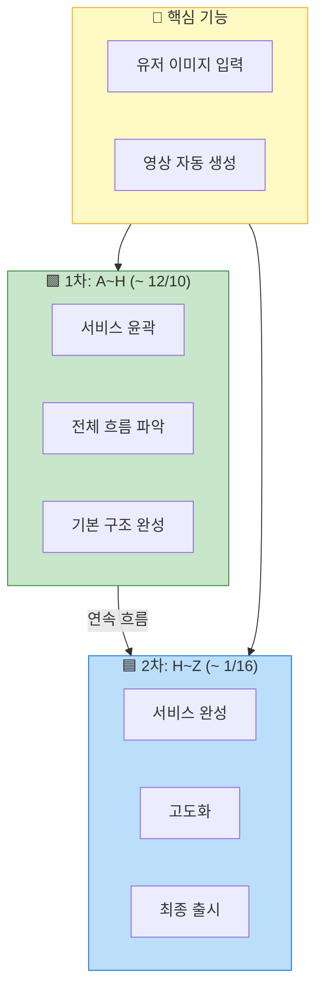
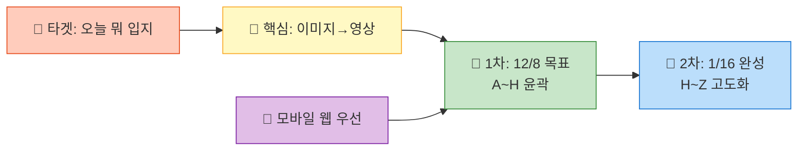

# OOTD_제5차_회의록_DOTD 최종 스케치_251201

---

## 1. 일정 및 범위

### 1차 기간: ~ 12월 10일 (화)
- **내부 목표**: 12월 8일 (월)까지 작업물 완료 목표
- **범위**: 전체 공정의 A~H 단계
  (서비스의 전체적인 윤곽과 흐름이 보이는 단계)

### 2차 기간: ~ 1월 16일 (목)
- **범위**: 전체 공정의 H~Z 단계
  (서비스 완성 및 고도화)

### 방향
- 1차와 2차는 분리된 것이 아니라 하나의 연속된 흐름으로 진행

---

## 2. 서비스 핵심 및 타겟 (페르소나)

### 핵심 기능
- 유저 이미지를 넣었을 때 영상이 생성되는 기능 (기존 유지)

### 타겟 페르소나 (3가지)
- 패션 초보 ('옷알못')
- "오늘 뭐 입지" 고민러 (핵심 타겟 / OTT 정체성)
- 트렌드 세터 (옷 입기를 즐기는 사람)

### UX 전략
- 첫 화면에서 'OTT(오늘 뭐 입지)' 정체성을 바로 보여주기
- 클릭을 통해 초보 / 트렌드 세터 메뉴로 진입하는 구조

---

## 3. 업무 분장 (R&R)

- **프론트엔드 / 화면 구성**: 기획팀 + 병익 선생님
- **백엔드 / 기술 구현**: 기술 파트장님 + 한솔님
- **영상 프롬프트/편집**: 팀장 + 근선님
- 자동화, 데이터 수집(스크래핑), 화면 연동 작업 담당

---

## 4. UI/UX 디자인 변경 사항

### 디바이스
- PC 기준 → 모바일 웹 환경 최우선으로 변경 (외부 사용성 고려)

### 레이아웃
- 기존 '가로 병렬(행) 배치)' 방식이 모바일 가독성에 좋지 않다는 의견(유리 파트장)을 수용
- 모바일에 최적화된 새로운 레이아웃으로 변경 (상세 시안 설명 직전)

---
---

## 🗓️ 일정 흐름도

---

## 👤 타겟 페르소나 구조

---

## 👥 업무 분장 (R&R)

---

## 📱 UI/UX 디자인 변경

---

## 🔄 전체 프로젝트 흐름

---

## 📊 핵심 요약

