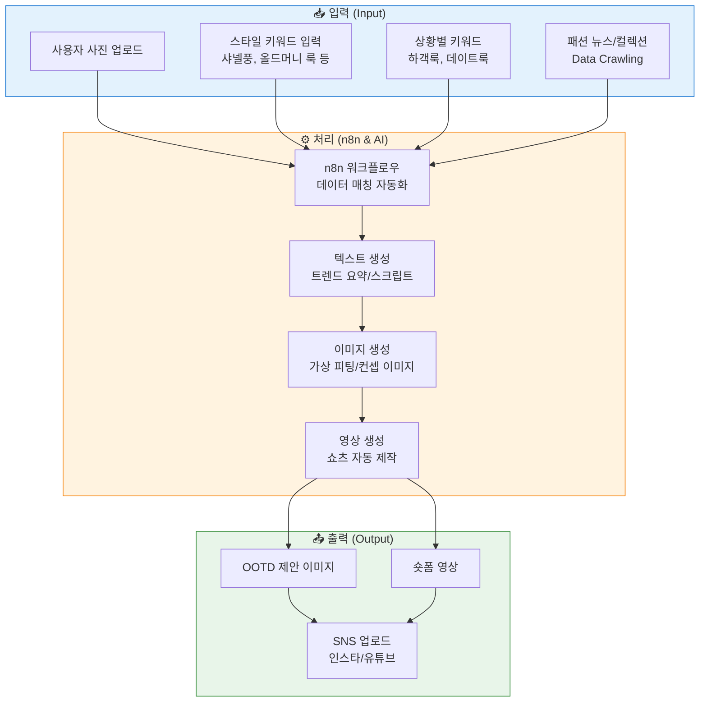
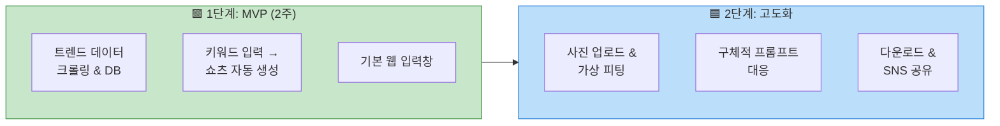
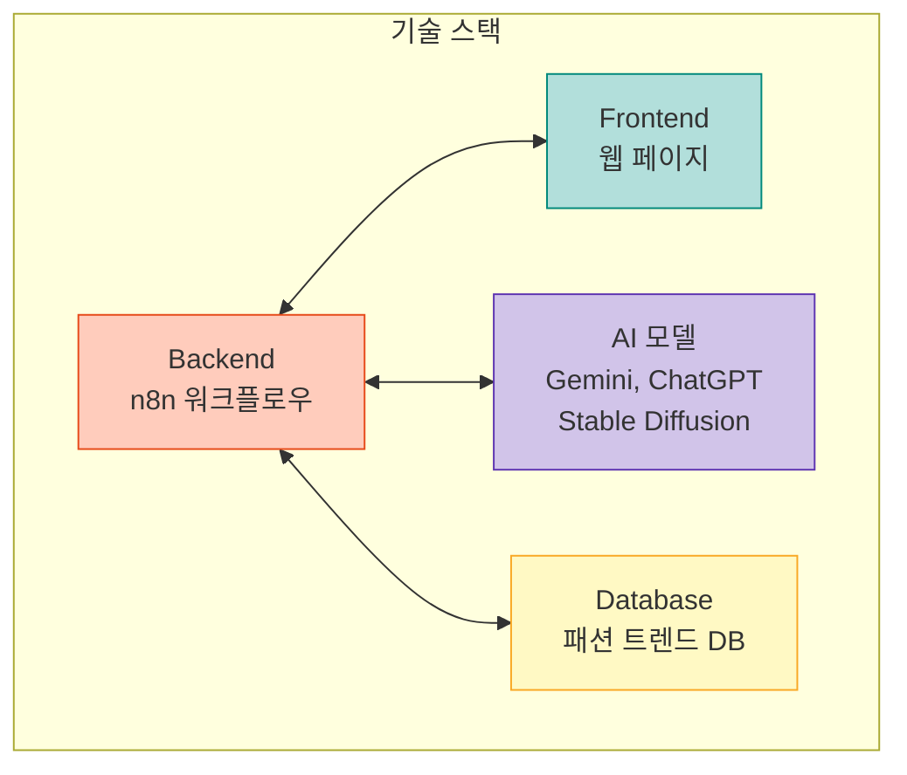

# AI 기반 패션 OOTD 콘텐츠 생성 프로젝트 회의록

**팀명** : DOTD  
**회의 일시** : 25.11.27(목) 11:30~13:20  
**팀원** : 김찬호, 오채언, 정환석, 정한솔, 최현미, 황병익 (장근선)

---

## 1. 프로젝트 개요

**목표**: 동아일보 주관 사업 과제 수행 (콘텐츠 크리에이팅, OSMU, 인터랙티브 콘텐츠)

**핵심 아이템**: AI 기반 패션 OOTD(Outfit Of The Day) 트렌드 제안 및 숏폼 생성 툴

**개발 방향:**
- 사용자(크리에이터/일반인) 입력값을 바탕으로 최신 트렌드 분석 후 숏폼/이미지 자동 생성
- 웹 페이지 기반의 인터랙티브 툴 형태 (n8n 자동화 활용)

---

## 2. 선정 주제: 패션 OOTD (오늘의 장착)

**선정 이유:**
- **트렌드 민감성**: 최신 정보 업데이트(Crawling)가 필수적 분야로 AI 활용도가 높음.
- **시각적 효과**: 영상(쇼츠) 및 이미지 콘텐츠로 제작하기에 가장 적합한 소재.
- **대중성**: '오늘 뭐 입지?'라는 대중적인 고민을 해결하고, 인스타그램/유튜브 등 원소스 멀티유즈(OSMU) 확장에 유리함.

---

## 3. 서비스 프로세스 및 기능

### 3.1. 입력 (Input)

**사용자 설정:**
- 본인 사진 업로드 (가상 피팅 목적)
- 원하는 스타일 키워드 (예: 샤넬풍, 2025 S/S 컬렉션, 올드머니 룩 등)
- 상황별 키워드 (예: 결혼식 하객룩, 데이트룩)

**데이터 수집 (Data Crawling):**
- 최신 패션 뉴스, 컬렉션 정보, 트렌드 사이트 실시간/주기적 수집
- 에디터들이 정리한 트렌드 정보 DB화

### 3.2. 처리 (Processing - n8n & AI)

**자동화 툴 (n8n)**: 입력된 데이터와 크롤링 된 최신 트렌드 정보를 매칭하여 워크플로우 자동화

**생성형 AI 활용:**
- **텍스트**: 트렌드 요약 및 영상 스크립트 작성
- **이미지**: 사용자 사진에 트렌드 의상 가상 피팅(Virtual Try-on) 또는 컨셉 이미지 생성
- **영상**: 이미지와 스크립트, 음성을 합성하여 쇼츠 영상 자동 제작

### 3.3. 출력 (Output)

**결과물**: "오늘의 OOTD" 제안 이미지 또는 숏폼 영상

**활용**: 사용자가 자신의 SNS(인스타그램, 유튜브 등)에 즉시 업로드 가능

---

## 4. 개발 로드맵 (2주 단기)

### 4.1. 1단계 (MVP - 기본 기능 구현)

**핵심 목표**: '입력 → n8n 자동화 처리 → 결과물(영상/이미지)'의 파이프라인 구축

**주요 기능:**
- 최신 패션 트렌드 데이터(뉴스, 컬렉션) 크롤링 및 DB 구축
- 사용자가 스타일 키워드 입력 시, 해당 트렌드를 반영한 쇼츠 영상 자동 생성
- 웹 페이지 형태의 기본 입력창 구현

### 4.2. 2단계 (고도화 - 인터랙티브 및 개인화)

**핵심 목표**: 사용자 사진을 활용한 개인화 서비스 및 UI 개선

**주요 기능:**
- 사용자 얼굴/전신 사진 업로드 및 가상 피팅 기능 추가
- "샤넬풍으로 입혀줘", "내년 봄 트렌드로 제안해줘" 등 구체적 프롬프트 대응
- 결과물 다운로드 및 SNS 공유 인터페이스 제공

---

## 5. 기술 스택 및 기대 효과

### 5.1. 기술 스택

- **운영/관리 (Backend)**: n8n (워크플로우 자동화)
- **프론트엔드 (Frontend)**: 웹 페이지 (사용자 입력 및 결과 확인)
- **AI 모델**: Gemini, ChatGPT (텍스트 생성), Stable Diffusion/Midjourney (이미지 생성)
- **데이터베이스 (DB)**: 동적 패션 트렌드 정보 수집 및 저장

### 5.2. 기대 효과 (동아일보 과제 관점)

- **자료 조사 효율화**: 에디터가 일일이 찾던 패션 트렌드를 AI가 자동 수집/요약하여 업무 시간 단축.
- **OSMU 확장**: 텍스트 기반의 패션 뉴스를 영상/이미지로 자동 변환하여 다양한 플랫폼에 배포.
- **트래픽 증대**: 독자가 직접 자신의 사진을 넣어 스타일링을 받아보는 참여형 콘텐츠로 체류 시간 확보.

---

---

## 🔄 서비스 프로세스 흐름도

---

## 🗓️ 개발 로드맵

---

## 🛠️ 기술 스택

