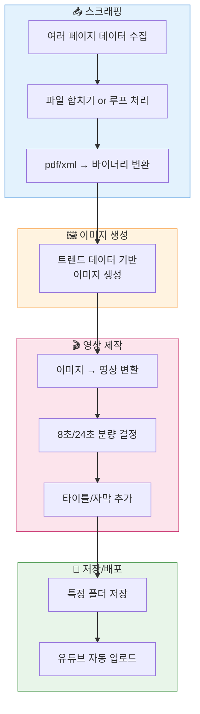
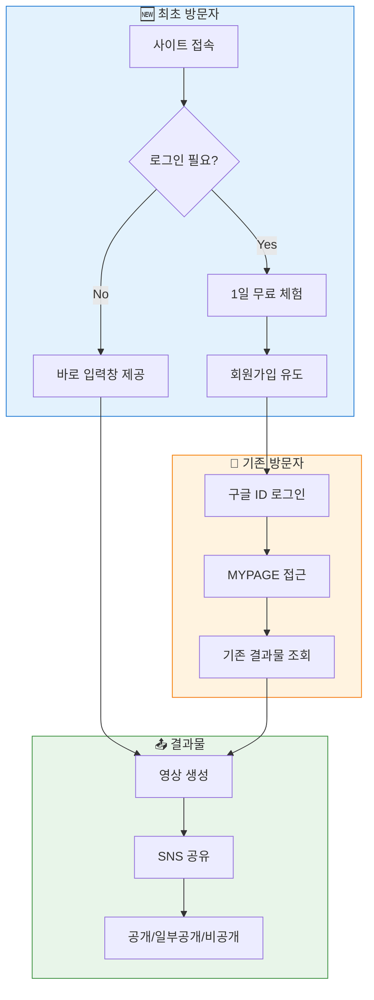
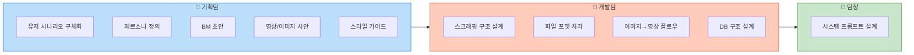

# 🧩 프로젝트 회의 정리본 (정리 버전)

---

## 0. 프로젝트 큰 그림

**목표**
- n8n 기반으로 
- 웹에서 입력 →
- 스크래핑 + 이미지/영상 생성 →
- 결과물(쇼츠 + 쇼핑 링크 등)을 자동으로 만드는 시스템.

**핵심 포인트**
- 아직은 기획/구조 설계 단계가 최우선.
- 웹퍼블리싱은 나중 (n8n/프로세스 어느 정도 확정 후) 진행.

---

## 1. 웹퍼블리싱 관련 논의

### 1-1. 현시점 판단: "시기상조"
- 지금 바로 웹에 올리기엔 자료와 구조가 부족.
- 최소한 n8n 기본 플로우가 잡혀야 웹으로 노출하는 게 의미 있음.
- "일단 만들고 나중에 고치자" 방식은
  → 수정/관리 비용이 너무 큼 → 비효율.

### 1-2. 방향 가능성
- 파일(페이지) 별로 조금씩 나눠서 올리는 방식도 가능은 함.

### 1-3. 정리된 결론 (웹 퍼블리싱)
**당장 할 일:**
- 웹을 완성하는 게 아니라,
- 최소 1페이지 분량의 구조/콘셉트 정도까지만 정의.
- 퍼블리싱은 n8n 구조와 기획이 확정된 후 본격화.

---

## 2. n8n 관련 논의

- 한 번에 전체를 다 만들기는 현실적으로 어렵다.

**기본 흐름 구상:**
- n8n → 이미지 생성 → 영상 생성 → 특정 폴더에 저장 (이후 유튜브 업로드 가능)

**결론:**
- 전체 완성이 아니라,
- "기본 프로세스(골격) + 테스트용 플로우"부터.

---

## 3. 스크래핑 페이지 기획

### 3-1. 전반적 고민
- 여러 출처에서 끌어온 데이터를 어떻게 합칠 것인가?
- 어디까지/얼마나 많이 가져올 것인가?
- "많을수록 좋다"가 아니라,
- 기획 의도에 맞는 적정량이 중요.
- **무엇을 만들지(결과물 이미지/영상/정보 구조)**가 선명해지면
  → 개발은 오히려 빠르게 가능
  → 기획이 가장 중요.

### 3-2. 데이터 소스 상태
- 업데이트 O: 예) 패션 뉴스
- 업데이트 X: (아직 후보/검토 대상들)

---

## 4. 유저 패턴 & 시나리오

### 4-1. 최초 방문자
- 로그인 없이 바로 입력창을 둘지 고민.
- 결과값은? 
  - SNS 공유를 기본 옵션으로 할지?
- **전략 예시:**
  - 1일 무료 체험 후 → 회원가입 유도 구조도 고려.

### 4-2. 기존 방문자
- "왜 로그인해야 하지?"에 대한 명확한 답 필요:
  - MYPAGE에서 기존에 생성한 결과물을 다시 볼 수 있게.
- **로그인 수단:**
  - 구글 ID 로그인 사용 시 
    - 민감정보를 적게 다루게 되며,
    - 당장 개인정보 이슈를 크게 신경 쓰지 않아도 됨.

### 4-3. 개인정보/저장 정책
- 사진 저장 X, 아웃풋 영상만 O
- 유저가 삭제 요청 시 삭제 가능해야 함.
- **관리자의 고민:**
  - 사진/영상/아바타 등을 
    - "한 번 쓰고 바로 버릴지"
    - "일정 기간 저장할지" (초상권/법적 이슈 고려)
- 유저 사용 이력을 저장할 DB 설계 필요.
- **모니터링/운영 화면 내 기능:**
  - 문의 응답
  - 회원 검색
  - 영상/사진 삭제 기능

### 4-4. 기획 영역에서의 키워드
**by 기획팀:**
- "오늘의 패션"은 하루의 상징/무드를 만들어주는 개념.
- "나의 예쁜 모습을 만든다"에 초점.
- **유저 패턴 파악을 위해:**
  - 상황/페르소나 정의가 필요 
  - 예: "Y2K 스타일을 좋아하는 20대 초반"… 등

### 4-5. MYPAGE & 아바타 옵션
- MYPAGE에 생성된 영상을 저장할 것인지 여부.
- **기본 베이스:**
  - 아바타 기반으로 할지
  - 내 사진을 직접 넣을 수 있게 할지 (내 착장을 보고 싶은 유저용)
- **유료화 플로우:**
  - "무료 체험 후 → 내 사진 기반 유료 서비스" 같은 구조 가능.
- **결과물 공개 범위:**
  - 전체공개 / 일부공개 / 비공개 옵션 설계.

---

## 5. BM (비즈니스 모델)

- 현실적으로 API를 계속 공짜처럼 쓰면 적자 구조.
- 호출 횟수 제한, 단가 등 고려 필요.
- **어느 시점/조건에서 유료화를 할지:**
  - 계정(ID)당 사용 가능 횟수?
  - 특정 기능 이상은 유료?
- "우리가 일방적으로 영상만 쏘는 것"과
- "유저 개인정보를 받고 관리하는 것"의 법적·운영상 차이 인식 필요.

---

## 6. Output 멀티유즈 전략

### 6-1. 기본 결과물 구상
- **영상 + 쇼핑 링크 (2차 목표까지)**
  - 예: 코디 추천 영상 + 해당 아이템 쇼핑 링크 붙이기
- **라벨링**
  - API에서 어느 정도 메타 데이터/라벨을 뽑아줄 수 있는지 체크 필요.

---

## 7. (개발) n8n 기본 프로세스 설계

### 7-1. 스크래핑 파트 (파트장님)
- 여러 페이지에서 가져온 내용을:
  - 하나의 파일로 합칠지
  - 루프를 돌려 여러 번 처리할지
- **포맷:**
  - pdf, xml 등 → 바이너리 파일 형태
  - 이를 n8n 노드로 어떻게 올릴지 고민 필요.

### 7-2. 영상 제작 파트 (한솔)
- 최초 생성된 이미지들을:
  - 몇 개의 영상으로 만들지
  - 각각 몇 초 분량으로 할지 (예: 8초, 24초 등)
  - 어떤 규칙으로 합칠지
- 생성된 영상을:
  - 특정 폴더에 저장하고
  - 유튜브 자동 업로드 노드까지 연결할지 여부.

### 7-3. 기술 파트 (병익)
- 웹페이지 퍼블리싱과 프롬프트 부분 (바이브 코딩).
- 퍼블리싱의 구체화는,
  - 기획이 확정된 이후 본격 반영.

---

## 8. 출력물(디자인/콘텐츠) 관련

### 8-1. 이미지 및 영상 시안
**차별화 포인트:**
- 분량과 레이아웃
- 시선이 어떻게 흐르는지
- 정면/측면/후면 등 구도

**필요한 요소:**
- 타이틀
- 워터마크
- 고객용 텍스트 (ex. CTA 문구)
- 레퍼런스 모음

👉 **기획팀 To-do:**
- 참고 페이지 수집
- 디자인 패턴/스타일 가이드 정리

---

## 9. 기타 논의 사항

### 9-1. 영상 저장 위치
- 용량/비용 관점에서 DB는 잘 맞지 않음.
- 유튜브를 기본 저장소/플랫폼으로 사용하는 방향이 현실적.

### 9-2. Daven 관련
- 단계별로 할 작업을 한 번에 처리할지,
- 아니면 여러 단계로 나눌지.
- **상세 UX:**
  - 핀터레스트 느낌으로 참고 이미지를 보여줄지
  - 입력창만 둘지
  - 입력창 + 참고 정보(예시·템플릿)를 함께 둘지.

### 9-3. 질문/열린 이슈
- "일반 사용자가 쓸 것인지?"
  vs "우리 내부에서만 쓸 도구인지?"
- **영상 편집 방향:**
  - **스토리가 거의 없는 초단편 쇼츠 (예: 24초짜리 3편)**도 괜찮은가?
- **시스템 프롬프트:**
  - 유저 입력 + 내부 프롬프트 구조를 설계할 책임: 팀장.
- 유료/무료 정책, 베타 기간, 기간 제한 등은 추가 논의 필요.

---

## ✅ 정리된 결정 사항 & To-do

### A. 이미 정리된 방향성
- 웹퍼블리싱은 지금 당장 전체를 만드는 게 아니라,
  - 최소 1페이지 콘셉트/구조 정도만 잡아둔다.
- n8n 프로세스(스크래핑 → 이미지 → 영상 → 저장) 골격을 먼저 만든다.
- 유저 쪽은
  - 로그인은 구글 ID 기반 검토
  - 사진 저장은 기본적으로 하지 않고, 영상 결과물만 관리하는 방향을 우선.
- 영상 저장/배포는
  - 유튜브 활용이 1순위 옵션될 듯.

### B. 역할별 To-do (초안)

**🔹 기획팀**
- 유저 시나리오(최초 방문/재방문/MYPAGE 플로우) 구체화
- 페르소나/사용 맥락 정의 (예: "Y2K 좋아하는 20대 여성…")
- 공개 범위 옵션(공개/일부공개/비공개) 정책안
- BM 초안: 무료/유료 구조, ID당 횟수 제한 안 만들기
- 영상/이미지 시안 1~2세트 제작 (정·측·후면 등)
- 타이틀/워터마크/텍스트 스타일 가이드 제작
- 참고 레퍼런스(사이트/영상) 모아서 패턴화

**🔹 개발팀 – n8n/백엔드**
- 스크래핑 구조 설계 (합치기 vs 루프)
- 파일 포맷(pdf/xml → 바이너리) 처리 플로우 설계
- 이미지→영상 변환 플로우 + 유튜브 업로드 노드 설계
- DB 구조(사용 로그, 영상 메타 정보) 설계

**🔹 팀장 – 시스템 프롬프트**

---

## 🔄 n8n 기본 프로세스 흐름도

---

## 👤 유저 시나리오 흐름

---

## 📋 역할별 To-do 구조

